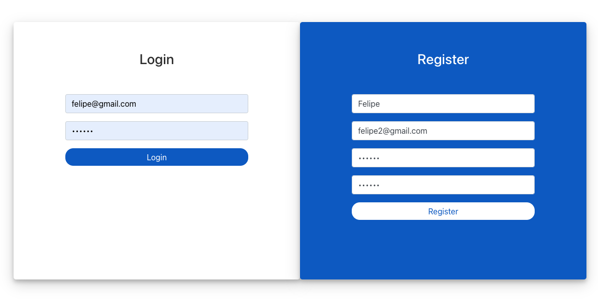
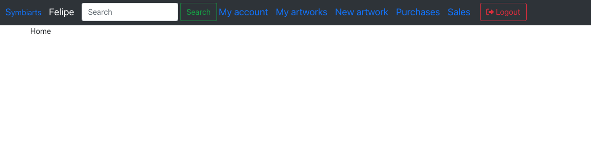

# Symbiarts React App

A React App for Symbiarts

## Description

In this app I use a backend server (symbiarts-node) with different endpoints.

## Getting Started

### Dependencies

- `npm`
- `node`
- Backend Server: Here is the example that I use in this repository: https://github.com/Felipe-Navas/symbiarts-node

### Installing

- Clone the repository and install dependencies:

```
git clone https://github.com/Felipe-Navas/symbiarts-react.git && cd symbiarts-react && npm install
```

- Configure your `.env` file in the root of the project and configure the `REACT_APP_API_URL` variable with the URL of the Backend Server

### Executing program

```
npm start
```

Preview of the principal page to login:



Preview of the main screen:



### Running tests

```
npm test
```

## Authors

- [Felipe Navas](https://www.linkedin.com/in/felipenavaslederhos) - [Email](mailto:felipenavas.itec@gmail.com?subject=[GitHub]%20symbiarts-react)

## Contributing

1. Fork it (<https://github.com/Felipe-Navas/symbiarts-react/fork>)
2. Create your feature branch (`git checkout -b feature/fooBar`)
3. Commit your changes (`git commit -am 'Add some fooBar'`)
4. Push to the branch (`git push origin feature/fooBar`)
5. Create a new Pull Request

## License

This project is licensed under the [MIT License] - see the LICENSE file for details
